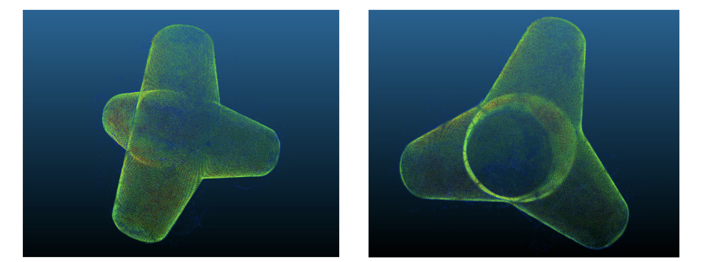

# Generation of a Generic tetrapod model from photogrammetric point clouds of breakwaters
This code implements the algorithm described in :
> N. Plantier, A. Li, S. Travadel, "Generation of a Generic tetrapod model from photogrammetric point clouds of breakwaters", 2023

Please, cite this article when using the code. 

The article can be found in the `final_report.pdf` file in the current repository.

## Source Files

Please, execute the algorithms in this order. 

- `planity_calculator.py` in `planity_calculator`  
Main program that implements the "flatness_measure" algorithm described in the paper.  

- `edges_calculator.py` in `edges_calculator`   
Main program that prepares the input of the watershed algorithm that will segment the 3D point cloud. It computes the edges of the 2D projection of the flatness measure. 

- `segmentation.py` in `segmentation`   
Main program that implements the watershed algorithm described in the paper.  

- `create_models.py` in `create_models`  
Main program that creates the different instances of the generic model from the output of the watershed algorithm.

- `find_axes.py` in `find_axes`  
Main program that creates the 3D probability map in each tetrapod where high probabilities represent points that are likely to belong to the axes of the feet of a tetrapod. 

- `find_points_axes.py` in `find_points_axes`  
Main program that finds out the points on that are likely to belong to the axes of a tetrapod.

- `find_axes_cpp.py` in `find_axes_cpp`  
Main program that implements the Iterative Hough Transform for straight lines detection algorithm.

- `draw_main_axes.py` in `draw_main_axes`  
Main program that draws the axes found inside the different tetrapods.

- `clean_tetrapods.py` in `clean_tetrapods`  
Main program that finds the feet inside the tetrapods and removes the outliers. 

- `create_generic_model.py` in `create_generic_model`  
Main program that finds the generic model of tetrapods. 

## Results

This algorithm allows you to visualize the results at each step. To do so, you can open the files inside `results` in each folder. 

- .las files can be opened with CloudCompare 
- .dat files need to be converted into .pts files before opening with CloudCompare 
- It is not necessary to open .csv files 

The final model can be found directly inside the current repository in the `final_density_model.las` file.  
Here is an image of the final generic model obtained from a total of 55 instances of tetrapods : 

## Installation 
The source code is written in Python and in C++ and thus requires a C++ compiler. 

Install the necessary requirements thanks to the `requirements.txt` file 

		pip install -r requirements.txt
    
## License

This code is provided under a MIT license. See the file LICENSE for details.
