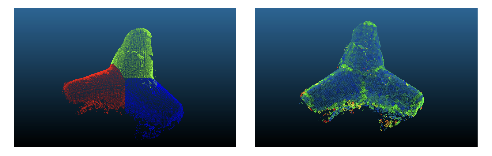

# Find feet and remove outliers algorithm

This algorithm finds the feet inside the tetrapods and removes the outliers. 

## Input 
- `main_axes` : the main axes found inside the different tetrapods
- `tetrapod_model_.las` : the corresponding tetrapods where outliers are removed 

## Output 
- `model_with_feet_.las` : same tetrapods but without outliers and with a flatness measure and an instance segmentation of the feet
Here is an overview of a tetrapod : its feet and the associated flatness measure. 

     

 
