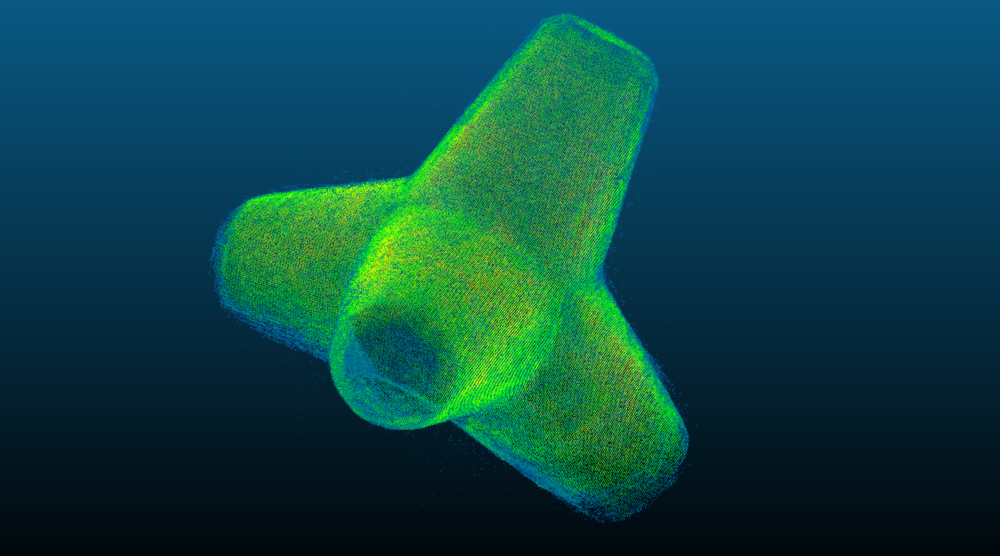

# Create density model

This algorithm concatenates the previous csv files to give the final model with the probability map. 

## Input 

- `new_fit_.csv` : the overlay of multiple tetrapods. 

## Output 

- `density_model.las`: model with probability map. 
Here is an example of results that can be visualized. 

    . 

 
