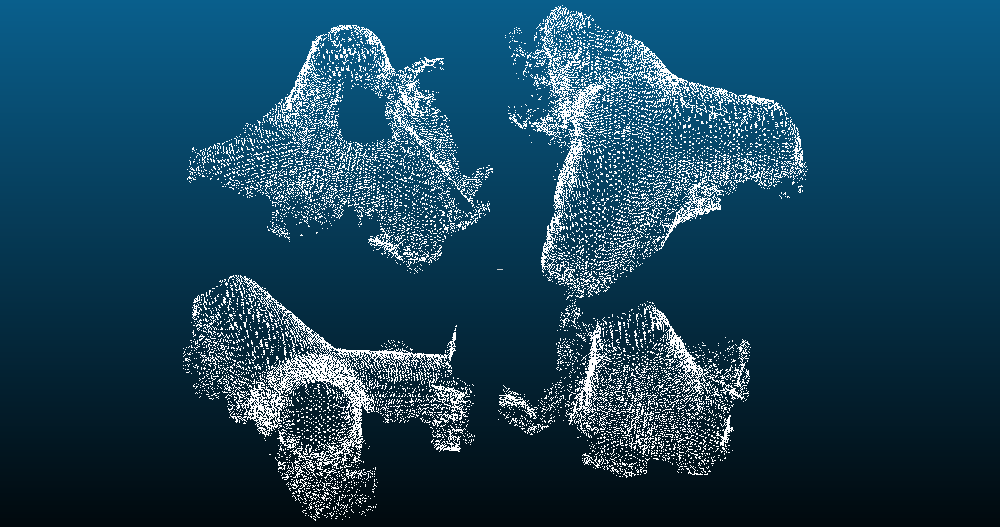

# Create models
This algorithm takes the results of the watershed algorithm to create the different instances of the generic model that we can find.

## Input 

- `ajaccio_patches_classified_dataframes` : results of the watershed algorithm

## Output 

- `tetrapod_model_{patch_number}_{i}.las` in `results`: .las file for every instance of tetrapod.  
Can be opened with CloudCompare. Here is an overview of the result (4 instances) in CloudCompare.

    . 

 
