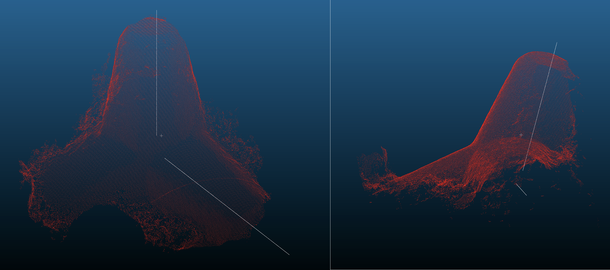

# Draw Main axes 

This algorithm creates new .las files of the tetrapods with the axes found inside. 

## Input 
- `main_axes_.dat` : the axes found inside the tetrapods = results of found_axes_cpp 

## Output 
- `models_with_axes`: new .las files of the tetrapods with the axes found inside.  
Here is an overview of the axes found inside a random tetrapod. 

    . 

 
