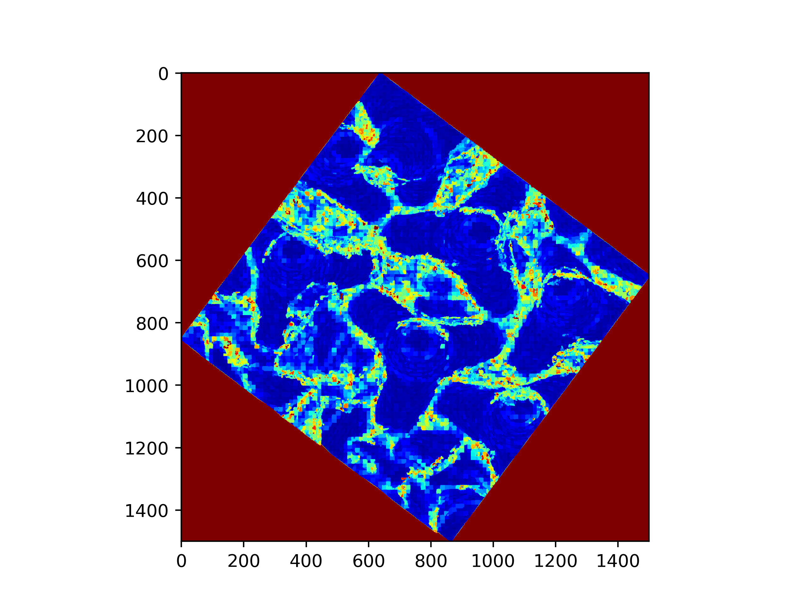

# Edges Calculator

This programme creates the edges of the image of the tetrapods in order to prepare the data for the watershed algorithm. 

## Input 

- `3d_patch_classified_test_.las` : patches of tetrapods with flatness_measure.  

## Output 

- `image_edges_.png`: 2D projection of the flatness_measure.  

    . 

 
