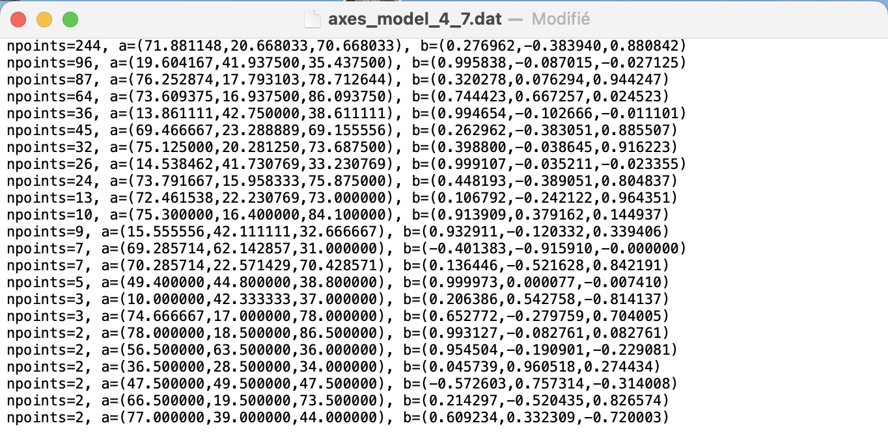

# Find axes using Hough Transform 

This program aims to find the axes of the tetrapods using the points detected before via the Iterative Hough Transform algorithm.

## Input 

- `point_cloud_tetrapod_model_1_0.dat` : points that are likely to belong to the axes 

## Output 

- `axes_model_.dat` : axes found inside the tetrapod (direction and center of mass).  
Here is an overview of the axes found inside a random tetrapod.  

    . 

 
