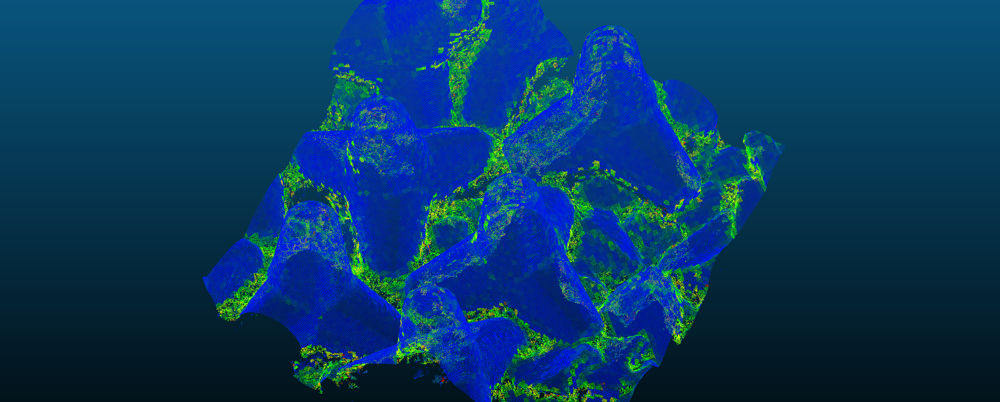

# Flatness Measure

This program implements the flatness measure described in the paper.
For privacy reasons, it was not possible to give acess to the initial 3D point clouds representing the dikes. You can only visualize the results inside the `results` folder and the corresponding code.  

## Input 

- .las files : different dikes of tetrapods.

## Output 

- 3d_patch_classified_test_.las : patches of tetrapods with flatness_measure.  
Can be opened in CloudCompare. Here is an overview of the final result. 

