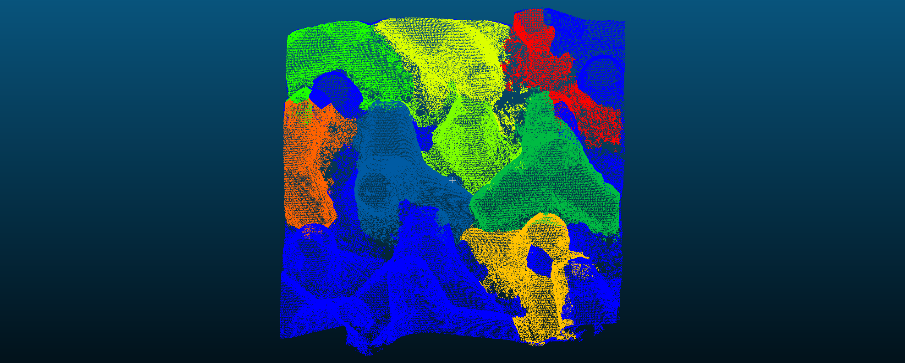

# Watershed Algorithm

This program implements the watershed algorithm.  
Execute the python file `segmentation.py` to get the results.

## Input 

- `tables_images` : where we find the scalar fied that comes from edges_calculator = 2D images corresponding to the flatness_measure

## Output 

- `tetrapods_mask_all` (parent directory) : for each tetrapod = an image where ones correspond to the pixels where the tetrapod is and zeros where it is not. 
- `gradients` : proprocessing of the input image 
- `labels` : all the labels found before applying the watershed algorithm
- `markers` : all the instances found
- `ajaccio_patches_classified_colors` : the corresponding .las files where a scalar field was added to identify each tetrapod identified.  
Here is an overview of the final results on a single patch. 

    . 

 

